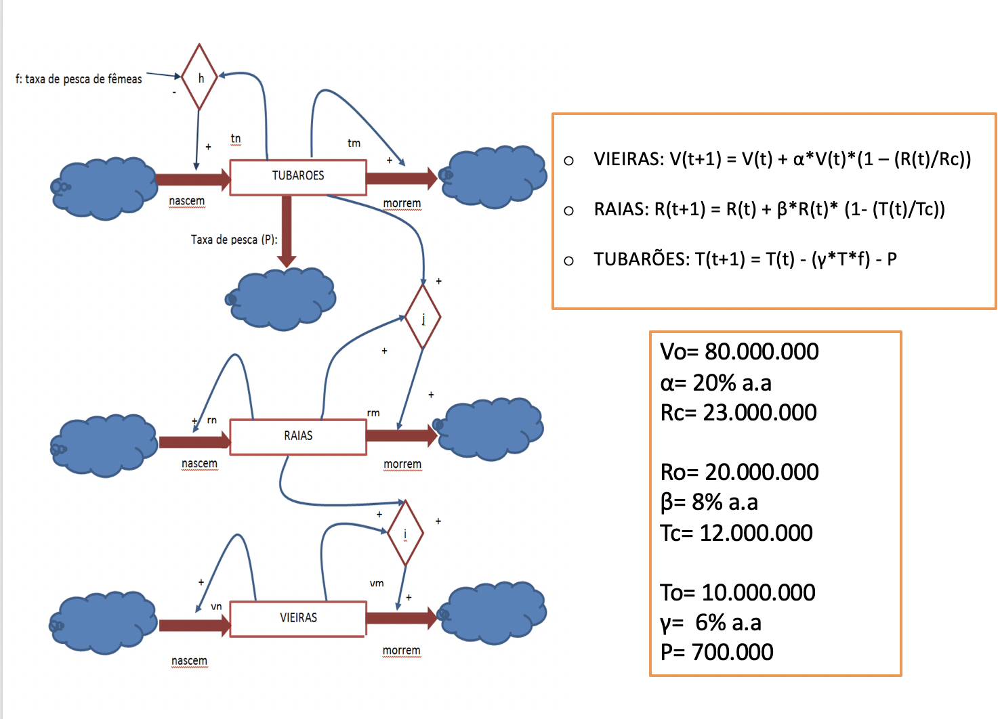

# Project 1 - Population Dynamics

This project involves the creation of a model for a physical system involving scallops, sharks and rays,
and the use of this model to answer a question
explanatory, predictive or related to the determination of the ideal parameters for a system. The question chosen to answer was "If "ecological sanctuaries" had been created where
females sharks were protected from threats and could thus procreate,
how it would have affected the population of scallops in the last
30 years?

##Population Model

The model used to answer this question:

