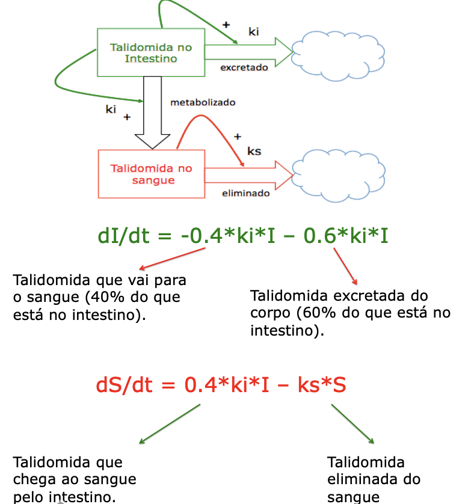

# Project 2 - Pharmacokinect Dynamics

The second project involves the creation of a model for a thermal or pharmacokinetic system and the use of this model to do some kind of work (ie, answer an explanatory, predictive or parametrization question). The question choosen to answer in this project was:
How long does it take to get pregnant safely after the ingestion of a certain amount of thalidomide?

## Pharmacokinect Model

The model used to answer this question:

