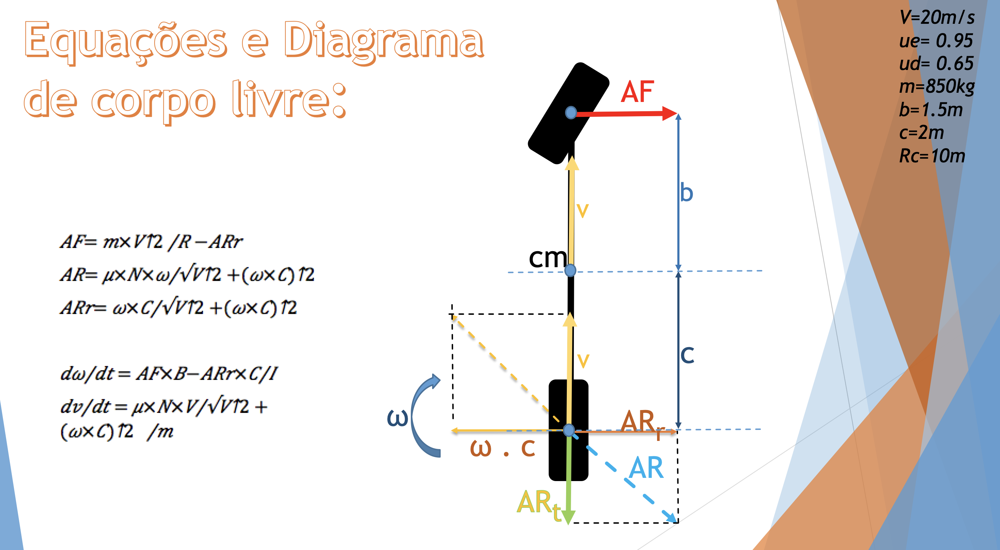

# Project 3 - Mechanical Systems

In this project, our focus was the modeling of mechanical systems - "mechanics" in the sense commonly used in physics.
As in the other two projects, the models, composed of systems of differential equations, could also be modeled using the techniques of stock and flow diagrams. However, the models of mechanical systems tend to be more complex, from a mathematical point of view.
In general, they use vector quantities, rather than scalar quantities, and differential equations are second order, unlike the first order equations found in pharmacokinetic systems. Another important point is that to facilitate the abstraction of the mechanical models, two fundamental tools will be presented: free-body digrams and coordinate systems. On this project the question chosen to be answer was the following: How does different initial velocities influence the final angle of the vehicle drifting?

## Mechanical System

The model used to answer this question:
